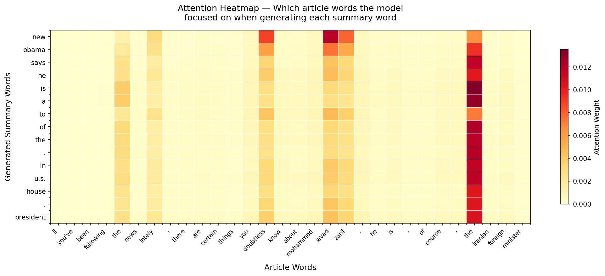
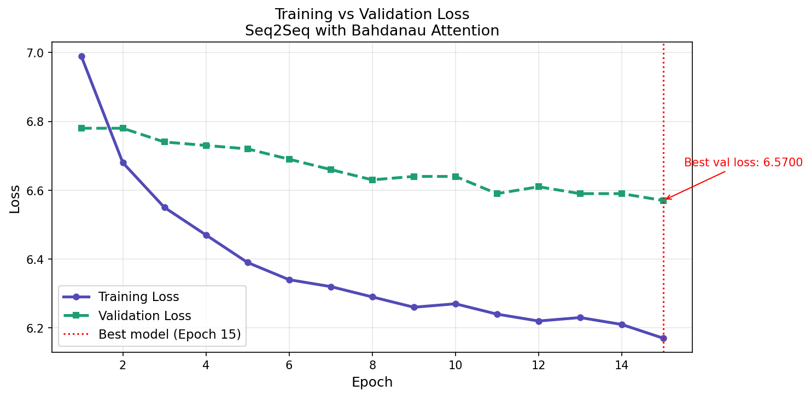

# Seq2Seq Text Summarizer with Bahdanau Attention


An abstractive text summarization model built completely from 
scratch using a Seq2Seq encoder-decoder architecture with 
Bahdanau (additive) attention mechanism — the architecture 
that directly preceded the Transformer.

---

## What makes this project unique

Unlike API-based summarizers, this model exposes its internal 
attention mechanism. You can see exactly which words in the 
article the model focused on when generating each word of the 
summary — a feature unavailable in black-box LLMs like GPT or Claude.



*Each row = one generated summary word. Each column = one article 
word. Darker = more attention paid to that word.*

---

## Architecture
Input Article
↓
Embedding Layer (128-dim)
↓
Bidirectional GRU Encoder
(reads article in both directions)
↓
Bahdanau Attention
(decides which article words matter most)
↓
GRU Decoder
(generates summary word by word)
↓
Linear Layer → Softmax
(picks next word from 20,000 vocabulary)
↓
Generated Summary
### Components

| Component | Type | Output Size |
|---|---|---|
| Embedding | Lookup table | 128-dim vectors |
| Encoder | Bidirectional GRU | 512-dim hidden states |
| Attention | Bahdanau additive | Context vector |
| Decoder | Unidirectional GRU | 256-dim hidden state |
| Output | Linear + Softmax | 20,000 word scores |

**Total parameters: 24,671,264**

---

## Dataset

- **Name:** CNN/DailyMail (version 3.0.0)
- **Source:** HuggingFace Datasets (`abisee/cnn_dailymail`)
- **Total samples:** 287,113 article-summary pairs
- **Used for training:** 20,000 samples
- **Validation:** 1,000 samples
- **Test:** 1,000 samples

Average article length: 592 words  
Average summary length: 43 words  
Average compression ratio: 9.2%

---

## Training



| Setting | Value |
|---|---|
| Optimizer | Adam |
| Learning rate | 1e-4 |
| Batch size | 16 |
| Epochs | 15 |
| Dropout | 0.5 |
| Teacher forcing | 0.75 → 0.55 (decay) |
| Early stopping patience | 5 |
| Best val loss | 6.5675 |
| Best val perplexity | 711.56 |

### Training techniques used
- **Teacher forcing with decay** — gradually reduces guidance 
  from 75% to 55% across epochs
- **Early stopping** — stops training when validation loss 
  stops improving
- **Gradient clipping** — prevents exploding gradients
- **Learning rate scheduling** — reduces LR when plateau detected
- **Dropout regularization** — prevents overfitting

---

## Key concepts implemented

### Bahdanau Attention
At each decoder step the attention mechanism:
1. Scores every encoder hidden state against current decoder state
2. Converts scores to weights via softmax (sum to 1.0)
3. Produces weighted context vector focused on relevant words

```python
energy  = V(tanh(W1(encoder_outputs) + W2(decoder_hidden)))
weights = softmax(energy)
context = sum(weights * encoder_outputs)
```

### Teacher Forcing
During training 75% of the time the real previous word 
is fed as input instead of the model's prediction. 
This stabilizes early training and speeds convergence.

### Beam Search Decoding
During inference keeps top-5 candidate sequences at each 
step instead of greedily picking one word — produces more 
coherent summaries.

---

## Results

| Metric | Value |
|---|---|
| Best validation loss | 6.5675 |
| Best validation PPL | 711.56 |
| Training time | ~150 minutes on Colab T4 |
| GPU | Tesla T4 (Google Colab) |

> **Note:** ROUGE scores are below state-of-the-art due to 
> intentional architectural constraints — small model size 
> (24M params vs BART's 400M) and limited training data 
> (20k vs 160GB). This project prioritizes architectural 
> understanding over benchmark performance.

---

## What I learned

This project was built to understand the foundations of 
modern NLP before using pre-trained models:

- How attention mechanism works mathematically
- Why encoder-decoder architecture was a breakthrough in 2015
- How teacher forcing stabilizes sequence generation training
- Why large pre-trained models like BART and T5 were necessary
- How to debug real ML problems: CUDA OOM, tokenizer mismatch, 
  overfitting, gradient explosion

---

## Project structure
seq2seq-text-summarizer/
├── seq2seq_summarizer.ipynb    ← main notebook
├── seq2seq_project/
│   ├── config.json             ← all hyperparameters
│   ├── training_history.json   ← loss per epoch
│   ├── plots/
│   │   ├── attention_heatmap.png  ← attention visualization
│   │   └── loss_curve.png         ← training curve
│   └── outputs/
│       ├── sample_outputs.json    ← generated summaries
│       └── results.json           ← evaluation results
├── .gitignore
└── README.md
---

## How to run

```bash
# clone the repo
git clone https://github.com/Sumit2005571/seq2seq-text-summarizer.git

# open in Google Colab
# Runtime → Run all
# skip training cell to use pretrained weights

# download pretrained model
# [Google Drive link — add after uploading]
```

---

## Roadmap

### Version 1.0 (Current)
- [x] Seq2Seq with Bahdanau attention from scratch
- [x] CNN/DailyMail dataset
- [x] Attention heatmap visualization
- [x] Beam search decoding
- [x] Early stopping and gradient clipping
- [x] Training loss visualization

### Version 1.1 (Planned)
- [ ] Fine-tune T5/BART for comparison
- [ ] ROUGE evaluation dashboard
- [ ] Increase training to full dataset
- [ ] Coverage mechanism to reduce repetition

### Version 1.2 (Planned)
- [ ] Hierarchical chunking for long documents
- [ ] Streamlit web interface
- [ ] Deploy on Hugging Face Spaces

---

## References

- Bahdanau et al. (2015) — 
  [Neural Machine Translation by Jointly Learning to Align and Translate](https://arxiv.org/abs/1409.0473)
- See et al. (2017) — 
  [Get To The Point: Summarization with Pointer-Generator Networks](https://arxiv.org/abs/1704.04368)
- Hermann et al. (2015) — 
  [Teaching Machines to Read and Comprehend (CNN/DailyMail)](https://arxiv.org/abs/1506.03340)

---

## Author

**Sumit** — B.Tech CSE (AI/ML), Manipal University  
GitHub: [@Sumit2005571](https://github.com/Sumit2005571)

*Built from scratch to understand the architectural foundations 
of modern NLP — not just to use pre-trained models.*
